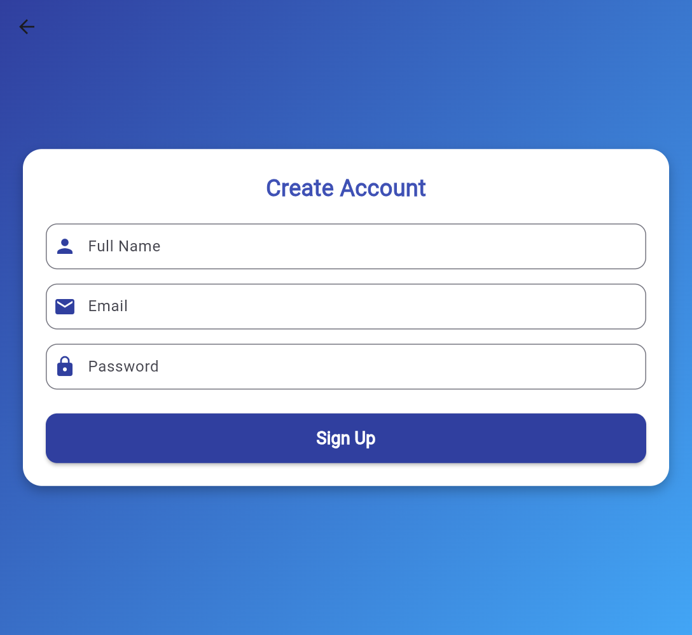
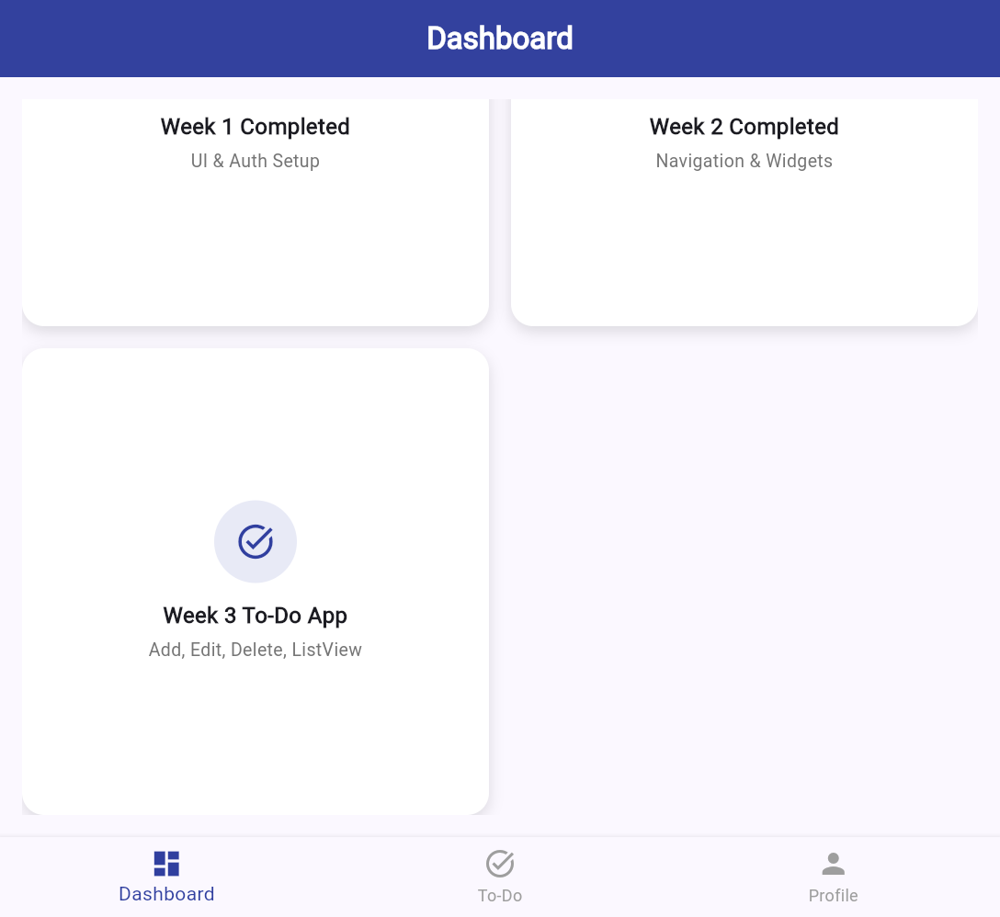

<div align="center">

# 🚀 Flutter Internship - Week 4

### API Integration & Weather App with FutureBuilder


**1-Month Flutter Development Internship | Week 4 of 4 - Final Project**

</div>

---

## 📋 Overview

**Week 4** is the final week of the internship, featuring a complete **Weather App** with real-time API integration using **FutureBuilder**. This project demonstrates HTTP requests, JSON parsing, async/await patterns, and graceful error handling.

## 🎯 Objectives

- Build a Weather App with live data from a free API
- Fetch and parse JSON weather data
- Implement `FutureBuilder` for async UI rendering
- Show loading indicators during API calls
- Handle network and API errors gracefully

## ✨ Features

| Feature | Description |
|---------|-------------|
| **City Search** | Search any city worldwide for live weather |
| **Live Weather Data** | Real-time temperature, condition, humidity, wind speed |
| **FutureBuilder** | Async UI rendering with loading, error, and data states |
| **Loading Indicator** | `CircularProgressIndicator` while fetching data |
| **Error Handling** | Network errors, city not found, empty input handling |
| **Beautiful UI** | Gradient backgrounds, card-based weather display |

## 🌐 API Integration

### API Endpoint
```
https://wttr.in/{city}?format=j1
```

### Response Structure
```json
{
  "current_condition": [{
    "temp_C": "32",
    "humidity": "65",
    "windspeedKmph": "12",
    "weatherDesc": [{ "value": "Partly cloudy" }]
  }]
}
```

### FutureBuilder Implementation
```dart
Future<Map<String, dynamic>> fetchWeather(String city) async {
  final url = Uri.parse('https://wttr.in/$city?format=j1');
  final response = await http.get(url);
  if (response.statusCode == 200) {
    return jsonDecode(response.body);
  } else {
    throw Exception("City not found");
  }
}

// In Widget
FutureBuilder<Map<String, dynamic>>(
  future: _weatherFuture,
  builder: (context, snapshot) {
    if (snapshot.connectionState == ConnectionState.waiting) {
      return CircularProgressIndicator();  // Loading
    } else if (snapshot.hasError) {
      return Text("Error: ${snapshot.error}");  // Error
    } else if (snapshot.hasData) {
      return WeatherCard(data: snapshot.data!);  // Data
    }
  },
)
```

## 📂 Project Structure

```
lib/
├── main.dart                        # App entry with ChangeNotifierProvider
├── providers/
│   └── todo_provider.dart           # TodoProvider - State management
├── screens/
│   ├── splash_screen.dart           # Splash / Loading screen
│   ├── login_screen.dart            # Login authentication screen
│   ├── signup_screen.dart           # User registration screen
│   ├── home_screen.dart             # Home with Bottom Nav (4 tabs)
│   ├── todo_screen.dart             # To-Do App with CRUD + Provider
│   └── weather_screen.dart          # Weather App with FutureBuilder
└── widgets/
    ├── custom_button.dart           # Reusable button widget
    ├── custom_textfield.dart        # Reusable text field widget
    └── product_card.dart            # Reusable card widget
```

## 🛠️ Getting Started

### Prerequisites
- [Flutter SDK](https://docs.flutter.dev/get-started/install) installed
- [Android Studio](https://developer.android.com/studio) or [VS Code](https://code.visualstudio.com/) with Flutter extension
- Internet connection (for API calls)

### Installation

```bash
# Clone the repository
git clone https://github.com/Mahnoor-fatima249/flutter_internship_week4.git

# Navigate to project directory
cd flutter_internship_week4

# Install dependencies
flutter pub get

# Run the app
flutter run
```

### Dependencies

| Package | Version | Purpose |
|---------|---------|---------|
| `provider` | ^6.1.2 | State management |
| `http` | ^1.2.0 | HTTP requests for API calls |

## 📸 Screenshots

### Login Screen
.png)

### Dashboard


### To-Do App


### Weather Search
.png)

### Weather Result
.png)

### Error Handling
.png)

## 📊 Complete Internship Summary

| Week | Topic | Key Skills |
|------|-------|------------|
| **Week 1** | Flutter Setup & Basic UI | Scaffold, AppBar, Text, Icon, TextField, Button |
| **Week 2** | Navigation & Reusable Widgets | Navigator, Custom Widgets, Bottom Nav, ListView, GridView |
| **Week 3** | CRUD & Provider | To-Do CRUD, Provider, ChangeNotifier, Consumer |
| **Week 4** | API & FutureBuilder | HTTP, JSON, FutureBuilder, Error Handling |

## 👩‍💻 Author

**Mahnoor Fatima**
- BSIT 6th Semester Student
- Backend & AI Developer

---

<div align="center">

[← Week 3](https://github.com/Mahnoor-fatima249/flutter_internship_week3) | **Week 4 of 4 - Final** 

*1-Month Flutter Internship Complete! 🎉*

</div>
